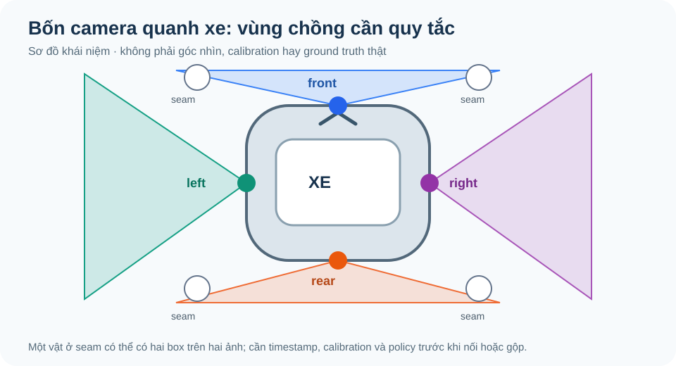
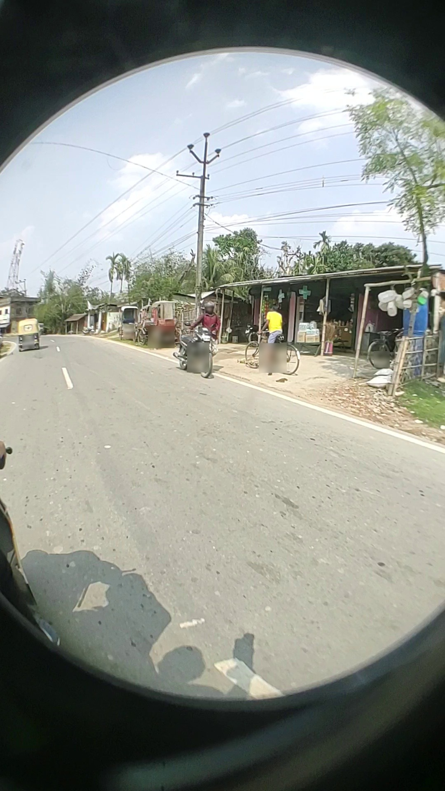
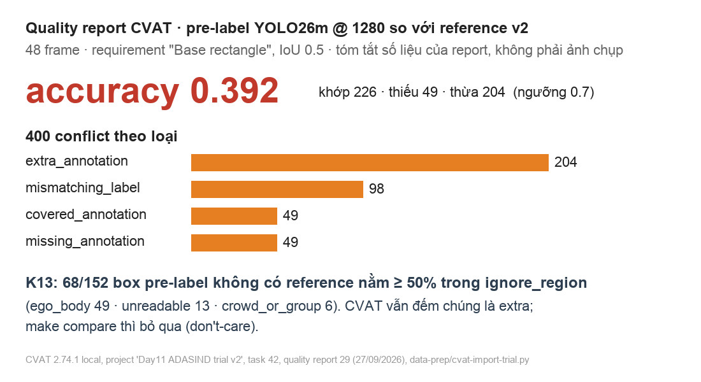

# GUIDE — làm bài Day 11 từ ảnh đến gói nộp

**Dành cho học viên · trạng thái: hướng dẫn thực hành của lab Day 11.** Mở file này cạnh CVAT. Buổi lab 240 phút P0–P6 bắt đầu bằng ảnh bãi đỗ camera thường, rồi chuyển sang ảnh fisheye **một camera** ADASIND. Bài lập kế hoạch bốn camera SVM là tình huống **giả lập**, không có 50.000 frame hay ảnh bốn camera trong repo. Dùng [README](README.md) để xem mục tiêu và gói nộp; file này chỉ đường thao tác, điểm dừng để kiểm, và cách gỡ lỗi.

## Bắt đầu nếu bạn chưa từng dùng Terminal

Mục tiêu của phần này là mở đúng thư mục và chạy được một lệnh kiểm tra. **Bạn không cần biết lập trình và không cần cài `make`.** Các lệnh của lab chạy bằng Python đã có sẵn trong repo. Terminal chỉ là cửa sổ để bạn gửi một câu lệnh cho repo; bạn sẽ luôn copy cả dòng, không sửa phần chữ trong lệnh trừ chỗ được ghi rõ.

### Mở Terminal ngay trong thư mục repo

1. Trên trang template Day 11, chọn **Use this template → Create a new repository** và đặt repo bài nộp là **Public**. Sau khi GitHub tạo xong, mở repo mới của chính bạn, bấm nút xanh **Code**, rồi chọn **Open with GitHub Desktop** nếu lớp đã cài GitHub Desktop. Chọn một thư mục dễ tìm như Documents và bấm **Clone**. GitHub Desktop sẽ tải repo về máy và sau này dùng để commit/push.
2. Nếu không có GitHub Desktop, trong cửa sổ **Code** chọn **HTTPS** rồi bấm biểu tượng copy cạnh đường dẫn. Mở Terminal hoặc Command Prompt và gõ `git clone ` (có dấu cách), dán đường dẫn vừa copy rồi nhấn Enter. Khi xong, một thư mục repo mới sẽ xuất hiện. Nếu máy báo không có `git`, chụp lỗi và báo Lab Coach; không dùng **Download ZIP** vì bạn cần commit/push repo cá nhân khi nộp.
3. Mở thư mục repo đó trong Finder (Mac) hoặc File Explorer (Windows). Thư mục đúng phải có các file `README.md`, `GUIDE.md` và `lab11.py` ở ngay bên trong.
4. **Mac:** nhấn `⌘ Space`, gõ `Terminal`, rồi mở Terminal. Gõ `cd` rồi gõ thêm **một dấu cách**. Kéo cả thư mục repo từ Finder thả vào cửa sổ Terminal và nhấn Enter. Cách kéo-thả này tự điền đường dẫn, nên không cần tự gõ tên thư mục.
5. **Windows:** mở thư mục repo trong File Explorer, bấm thanh địa chỉ ở trên cùng, gõ `cmd`, rồi nhấn Enter. Một cửa sổ Command Prompt sẽ mở ngay trong thư mục đó.
6. Copy **một** lệnh kiểm tra phù hợp dưới đây, dán vào cửa sổ vừa mở và nhấn Enter:

```bash
# Mac
python3 lab11.py --help
```

```text
# Windows
py lab11.py --help
```

Kết quả mong đợi: màn hình hiện tên các lệnh như `doctor`, `mode`, `cvat`, `draft` và `check`. Nếu thấy `No such file`, `can't open file` hoặc không thấy tên lệnh, bạn đang ở sai thư mục: làm lại bước 2 hoặc 3 đến khi thấy file `lab11.py`. Nếu `python3` hoặc `py` không được nhận, chụp nguyên dòng lỗi và báo Lab Coach để cài Python 3.9 trở lên; đừng tải ngẫu nhiên phần mềm trong giờ lab.

### Cách đọc lệnh trong guide này

Các khối lệnh bên dưới dùng dạng Mac `python3 lab11.py ...`. Trên Windows, chỉ thay **`python3` ở đầu dòng** bằng **`py`**, phần còn lại giữ nguyên. Ví dụ:

| Bạn cần làm | Mac | Windows |
|---|---|---|
| Kiểm môi trường | `python3 lab11.py doctor` | `py lab11.py doctor` |
| Xem việc tiếp theo | `python3 lab11.py status` | `py lab11.py status` |

Phần trong dấu `<...>` là chỗ bạn thay bằng dữ liệu của mình. Chẳng hạn `<zip-cuối>` là file ZIP bạn vừa tải từ CVAT; không gõ nguyên dấu `<` và `>`. `make` chỉ là lối tắt dành cho người đã có công cụ đó, không phải điều kiện để làm bài. [Rubric 100 điểm](RUBRIC.md) cho biết người soát xem bằng chứng nào; `python3 lab11.py check` kiểm cấu trúc và độ đầy đủ, **không chấm chất lượng nhãn hay lập luận**.

## P0 · phút 0–40 — khởi động: repo, CVAT, bãi đỗ và kế hoạch

1. Giữ repo bài nộp ở chế độ **Public** để người chấm mở được link; template nguồn có thể còn private trước lúc phát lớp. Mở Docker Desktop và chờ Engine chạy. Trong thư mục CVAT đã cài từ Day 2 (ví dụ `cvat-day2`), chạy `docker compose start`; nếu báo chưa có container, dùng `docker compose up -d`. Trở lại thư mục repo học viên, mở `http://localhost:8080` và đăng nhập tài khoản Day 2. Không cài một CVAT khác cho bài này.
2. Chạy `python3 lab11.py doctor`. Đọc `submission/00_setup/doctor.txt`: Python cần từ 3.9, CVAT kết nối được, Git không track `.env`, repo Public được xác nhận hoặc bạn tự kiểm nếu không có `gh`. Nếu CVAT không kết nối, xem [hướng dẫn khởi động và lỗi](docs/01-guide-cvat-vi.md). Sau buổi có thể chạy `docker compose stop` trong thư mục CVAT; **không dùng `docker compose down -v`** vì có thể xoá task và nhãn đã lưu.
3. Solo chạy `python3 lab11.py mode --members ten-cua-ban`. Nhóm 2–3 người: mọi người dùng cùng danh sách tên nhưng mỗi người khai mình qua `--self`, ví dụ `python3 lab11.py mode --members an,binh,chi --self binh` trong repo của Bình. Lệnh tạo `submission/00_setup/mode.json`, thêm `team.json` khi có nhiều người và in **Slice của bạn**. Dùng slice đó ở P2; thiếu `--self` trong nhóm sẽ bị từ chối để tránh cả nhóm làm cùng một slice. Điền `submission/00_setup/sensor_context.md` bằng **quan sát từ ảnh**, không đoán thông số rig chưa có. Dành phút 0–20 của P0 cho các việc này.

**Điểm dừng:** `python3 lab11.py doctor` không còn dòng `✗`, `mode.json` có slice và `sensor_context.md` không còn `TODO`. Nếu máy không có `gh`, tự mở GitHub → Settings để xác nhận repo Public; dòng `!` của `doctor` không thay xác nhận đó.

### P0 · phút 20–35 — vạch ô đỗ và free-space

Hai ảnh dưới đây đã đi kèm repo và có nguồn, giấy phép trong [DATA_LICENSES](docs/DATA_LICENSES.md). Chúng là ảnh bãi đỗ camera thường. Hãy tự nhìn ảnh và chọn vạch trước khi xem lời giải của bất kỳ người nào.


*Ảnh core — “Parkinglot empty”, Öljylautta, public domain. Tìm các đoạn sơn phân chia **từng ô đỗ** và phần lối xe chạy trống nhìn thấy; ảnh này không cung cấp vùng lái xe an toàn hay ground truth.*


*Ảnh đối chiếu — “Apartment Complex Parking Lot 1”, TylerMascola, CC0 1.0. So vai trò của vạch chia ô ở tiền cảnh với mép/lối xe chạy; **không** đưa ảnh này vào task export của bài core.*

1. Chạy `python3 lab11.py parking` để in đường dẫn chính xác tới `assets/parking/parking-lot-core.jpg` và `assets/parking/labels.json`. Trong CVAT: **Tasks → + → Create a new task**; đặt tên `Day11 · parking_line · public-sample`; **Labels → Raw**, xoá nội dung có sẵn và dán toàn bộ `assets/parking/labels.json`, bấm **Save**; **Select files → My computer**, chọn **chỉ** `parking-lot-core.jpg`; **Submit & Open → Job #…**.
2. Trên ảnh core, chọn **Draw new polyline → parking_line → Shape**, bấm từng điểm dọc theo phần sơn nhìn thấy của **ít nhất hai vạch phân chia hai ô riêng**, bấm **N** hoặc **Done** để kết thúc mỗi polyline. Đường dừng tại chỗ vạch bị che hay kết thúc; không nối qua phần không thấy. Chọn **Draw new polygon → free_space → Shape**, bấm ít nhất ba điểm bao phần mặt đường trống **nhìn thấy được** của lối xe chạy, kết thúc bằng **N/Done**. Polygon không chạy xuyên xe, curb, cây hoặc vùng bị che. Một vạch là mép đường, mũi tên, vạch qua đường hay chỉ dẫn lối xe chạy thì không tự động là `parking_line`.
3. **Ctrl+S**. Trong job: **Menu → Export job dataset → CVAT for images 1.1**, tắt **Save images**; tải ZIP từ thông báo hoặc **Requests**. Chạy `python3 lab11.py parking --file <đường-dẫn-tới-zip>`. Lệnh lưu `submission/parking/annotations.xml` và báo số polyline/polygon hợp lệ theo định dạng. Điền `submission/parking/observations.md`: hai vạch đã vẽ ở đâu, một dấu sơn/biên đã **không** vẽ và vì sao, free-space dừng ở đâu, ca còn nghi ngờ. [Luật vạch ô đỗ](docs/11-parking-lines-vi.md) giải thích ranh giới; hình học vẫn do người soát trên ảnh.

**Điểm dừng:** `python3 lab11.py parking --file <zip>` nhận đúng **một ảnh core**, ≥2 polyline `parking_line` và ≥1 polygon `free_space`; ghi chú hết `TODO`. Nếu báo sai ảnh, tạo/export lại task chỉ chứa ảnh core. Nếu báo thiếu hình, kiểm **kiểu hình** trong XML: rectangle không thay được polyline; bấm **Ctrl+S** rồi export lại.

### P0 · phút 35–40 — phác kế hoạch bốn camera

Phác `submission/45_sampling_plan.csv` cho `front/rear/left/right × normal/hard`, tổng **200 frame** từ bài toán 50.000 frame giả lập trên slide, và ghi ý đầu tiên vào `submission/46_gold_set_plan.md`. Sau P4, quay lại bổ sung lý do dựa trên lỗi đã thấy. [Bài đọc SVM 10 phút](docs/10-svm360-reading-vi.md) giúp phân biệt camera, seam, BEV, free-space và tracking. Teaching reference ADASIND **không** phải gold set bốn camera.



*Sơ đồ chỉ để đặt câu hỏi lập kế hoạch: mỗi camera cần ca normal/hard riêng; một vật tại seam có thể xuất hiện hai lần mà chưa chắc là lỗi trùng. Không dùng hình này làm calibration hoặc nhãn chuẩn.*

## P1 · phút 40–70 — calibration rồi xem tín hiệu chất lượng

1. Chạy `python3 lab11.py cvat C0`. Lệnh in tên task có `raw_fisheye`, đường dẫn `assets/labels.json`, ảnh cần nạp và XML prefill. Trong CVAT: **Tasks → + → Create a new task**; chép đúng tên in ra; **Labels → Raw**, dán toàn bộ JSON, **Save**, sang **Constructor** kiểm sáu class động và `ignore_region` có attribute `reason`; **Select files → My computer**, chọn đúng ảnh lệnh liệt kê; **Submit & Open → Job #…**. Ở trang task: **Actions → Upload annotations → CVAT 1.1**, chọn XML prefill lệnh in ra, xác nhận; mở job để kiểm box và `lens_border` đã hiện.
2. Tự kiểm ảnh gốc rồi sửa/điền nhãn C0 theo [rules v1.0.0](docs/02-rules-vi.md). Vật cao ≥40 px trong vùng hợp lệ cần box; box bám phần nhìn thấy trên fisheye gốc. Rider ngồi trên xe hai bánh thành một `Bike`, người dắt xe là `Pedestrian` và `Bike` tách. `truncated` do vòng kính/khung cắt; `occluded` do vật khác che. `lens_border` đã có sẵn để **soát**, `ego_body` vẽ khi có thân xe nhìn thấy. Chưa mở teaching reference khi đang làm độc lập.



*Ảnh minh hoạ quan sát, **không phải đáp án C0** — ADASIND của Singh, Biswas và Paul, CC BY 4.0; bản repo chọn tập con và làm mờ khuôn mặt/biển số. Quan sát vòng kính, méo ở rìa và vùng thân xe ở đáy; không suy vị trí gần/xa của vật từ bin `center/mid/edge`.*

3. **Ctrl+S → Menu → Export job dataset → CVAT for images 1.1**, tắt **Save images**, tải ZIP. Chạy tuần tự `python3 lab11.py lock calib <zip-C0>`, `python3 lab11.py reference calib`, `python3 lab11.py compare calib`. Mã khoá nằm trong `submission/p1_calib/lock.txt`; sau khoá mới mở reference. Đọc `submission/p1_calib/compare.md` và `compare.html` để chọn ca cần giải thích. Đây là teaching reference đã sửa tay, có thể sai; nếu thấy ca đáng ngờ, ghi frame, vật và luật, không tự biến reference thành chân lý.
4. **Sau khi tự làm và khoá C0**, xem đồ hoạ tổng hợp pre-label do Lab Coach chiếu hoặc ở dưới; ghi ba finding đầu vào `submission/findings.csv`, nêu rõ tín hiệu nào là số tổng hợp và ca nào cần soi trên ảnh. Tham gia clinic 12 phút trên [sáu ngộ nhận](docs/06-misconceptions-vi.md).



*Tín hiệu dạy học từ thử nghiệm CVAT local trên 48 frame: các số trong hình thuộc pre-label YOLO26m so với teaching reference của lần thử đó. Chúng **không** là điểm đạt của bạn, không chứng minh mọi conflict là lỗi model, và không thay việc soi frame. Ignore region được `python3 lab11.py compare ...` xử lý khác báo cáo CVAT; đọc [taxonomy và giới hạn phép đo](docs/05-taxonomy-vi.md).*

**Điểm dừng:** có `submission/p1_calib/annotations.xml`, `lock.txt`, `reference.txt`, `compare.md` và `compare.html`; ba dòng đầu trong `findings.csv` nêu đúng frame/object khi ghi ca cụ thể. Nếu `python3 lab11.py reference calib` báo chưa khoá, làm lại đúng thứ tự. Nếu upload prefill thất bại, báo Lab Coach; [cách thao tác CVAT](docs/01-guide-cvat-vi.md) nêu đường lùi vẽ từ ảnh gốc.

## P2 · phút 70–125 — gán nhãn fisheye, tự soát và khóa bản cuối

*Phút 70–125 · vai Annotator: bản nháp → tự soát → bản khóa.*

1. Chạy `python3 lab11.py cvat <slice-trong-mode.json>`. Lệnh in **đúng ba ảnh** và file `assets/prefill/<slice>.xml`. Tạo task mới như P1; tên phải chứa `raw_fisheye`. Import XML bằng **Actions → Upload annotations → CVAT 1.1**. Frame 1 có nửa box prefill và `lens_border`; bạn phải soát từng box, sửa/giữ/xoá/vẽ thêm. Nếu cần hỗ trợ, chạy `python3 lab11.py cvat <slice> --support` **trước khi tạo/import task** để lấy prefill thêm cho frame 2; chuẩn nhãn và bằng chứng không đổi. [Support và stretch](docs/09-support-stretch-vi.md) giải thích lựa chọn này.
2. Mở từng frame bằng **F** (tiếp) và **D** (trước). **Draw new rectangle → Label → Shape**, bấm góc trên trái rồi góc dưới phải; chọn object, kéo cạnh/đỉnh để sửa; **Del** xoá, **Ctrl+Z** hoàn tác. **Draw new polygon → ignore_region → Shape**, bấm từng điểm và **N/Done**, rồi ở sidebar **Objects** chọn `reason`: `ego_body` cho thân xe khi nhìn thấy, `lens_border` chỉ soát polygon đã import; các `reason` khác theo R06. Frame `adasind_006840.jpg` và `adasind_271039.jpg` không có ego body nhìn thấy, đừng thêm polygon cho hai frame đó. Dùng [checklist 9 mục](docs/04-selfqc-checklist-vi.md) khi soát scope, class, rider, geometry, attribute, thiếu/trùng và ignore.
3. Nếu làm K12, dùng các đối tượng lệnh `python3 lab11.py cvat ...` in ra: vẽ **polygon viền thấy được** cùng class với box cho bốn đối tượng, chọn box + polygon bằng **Ctrl+click**, bấm **G** để cùng `group_id`; `python3 lab11.py fill` dùng cặp này tính fill ratio. Đây là phép minh hoạ hình học của lab, không phải chỉ số ngành. Nếu thời gian trễ, theo [thứ tự cắt giảm](docs/08-degrade-vi.md) và ghi `python3 lab11.py degrade k12` khi đến bước đó.
4. **Ctrl+S**, export **CVAT for images 1.1**, tắt **Save images**. Chạy `python3 lab11.py draft <zip-nháp>`: XML nháp vào `exports/r1-draft.xml`. Chạy `python3 lab11.py fill` (nếu làm K12), rồi `python3 lab11.py selfqc r1_craft`. Đọc `submission/r1_craft/selfqc.md`: xử lý cảnh báo tự động, soát tay đủ chín mục theo thứ tự và đổi từng `- [ ]` thành `- [x]` **sau khi đã kiểm trên ảnh**. Lệnh tự động không thể biết một vạch box có thật ôm đúng vật hay class có đúng ngữ cảnh.
5. Quay lại CVAT sửa những gì self-QC phát hiện. **Ctrl+S**, export **bản cuối** thành ZIP khác, rồi `python3 lab11.py lock r1_craft <zip-cuối>`. Lệnh in mã `XXXX-XXXX`; lưu mã và đưa cho người soát. Bản nháp không thay bản khoá. Không sửa file XML trong `submission/r1_craft/` sau khoá; nếu thật sự cần khoá lại, ghi lý do vào `submission/40_decision_log.csv` rồi dùng `--relock` theo [hướng dẫn lỗi CVAT](docs/01-guide-cvat-vi.md).

**Điểm dừng:** `submission/r1_craft/annotations.xml`, `lock.txt`, `selfqc.md` có đủ chín ô đã soát; mã khoá khớp bản cuối. Nghỉ 15 phút ở mốc dự kiến 125–140.

## P3 · phút 140–165 — vai QA: soát mù bằng luật

Nhóm 2–3 người đổi bài theo vòng trong [quy tắc ba vai](docs/03-roles-rotation-vi.md); nhận **file đã khoá**, slice và mã khoá từ bạn kế bên. Nếu làm solo hoặc chờ hơn 5 phút, nghỉ ít nhất 5 phút rồi cold review chính bản khoá của mình. **Chưa mở teaching reference, model overlay hay worked HTML** trong pha QA.

Chạy `python3 lab11.py qa --slice <slice-của-file-nhận> --file <zip-hoặc-xml-đã-khoá> --code <mã-khoá>`. Mở `submission/r2_qa/qa_overlay.html`, điền `qa_review.md` bằng frame, object_ref, `rule_id` và nhận xét dựa trên ảnh/rules. Thêm các dòng `round=r2_qa` vào `submission/findings.csv`, có `rule_id`, **để `why` trống**: QA đang ghi điều quan sát và luật liên quan, chưa chẩn đoán nguyên nhân. `cell=L_only` cho dòng QA theo mẫu của lệnh. Nếu mã khoá không khớp, yêu cầu đúng export đã khoá thay vì đoán mã.

**Điểm dừng:** có `qa_overlay.html` và `qa_review.md` hết `TODO`; mỗi nhận xét chỉ rõ một frame/object/luật. Nhớ trả lời từng nhận xét QA ở P4, kể cả khi quyết định giữ nhãn.

## P4 · phút 165–200 — vai Diagnostician: đối chiếu và quyết định

Quay về **slice của chính bạn**. Chạy theo thứ tự:

```bash
python3 lab11.py reference r1_craft
python3 lab11.py compare r1_craft
python3 lab11.py local-quality
python3 lab11.py model
python3 lab11.py iou-sweep --iou 0.3,0.5,0.7
```

`python3 lab11.py reference r1_craft` chỉ mở reference sau bản khoá. `compare.md`/`compare.html` cho khác biệt nhãn của bạn (L) với teaching reference (R). `r3_diag/local_quality.md`, `.json`, `local_quality_conflicts.csv`, `local_quality_confusion.csv` là phép tính **offline** từ rectangle theo quy tắc lab; `model_compare.md`/`.html` thêm model đóng băng (M). `iou_sweep.md` cho biết kết quả ghép nhạy thế nào với ngưỡng IoU. **Không cần CVAT Premium** cho bất kỳ bước bắt buộc nào; `python3 lab11.py cvat-quality` chỉ là thử nghiệm tùy chọn nếu môi trường có tính năng đó. Số local và giao diện CVAT có thể khác do cách ghép/filter/ignore; [taxonomy và công thức](docs/05-taxonomy-vi.md) nêu giới hạn.

Trên `submission/findings.csv`, đọc các dòng máy thêm, đối chiếu **ảnh gốc + overlay + luật** rồi điền `why`, `severity`, `owner`, `action` cho dòng chẩn đoán `r3_diag`; trả lời các dòng QA. `what` mô tả hiện tượng, `why` là phán đoán của bạn. `E0_reference_defect` hợp lệ khi có bằng chứng reference sai; `E5_unresolved` hợp lệ khi chưa đủ bằng chứng và bạn ghi rõ cần kiểm gì. Không gán `E4_model_domain` chỉ từ một box lệch. Mức P0–P3 là ưu tiên xử lý **trong bài lab**, không phải phân hạng rủi ro sản xuất. Chạy `python3 lab11.py triage` để kiểm enum và trường bắt buộc; sửa CSV rồi chạy lại đến khi hết lỗi. `python3 lab11.py model` đã ghi sẵn bảng số của `submission/r3_diag/zone_table.md`; bạn chỉ viết mục **Nhận xét** (zone gãy nhiều nhất, giả thuyết và giới hạn của slice ba frame). Sau `python3 lab11.py reference r1_craft`, repo tự tạo thêm bốn mẫu P4–P6: `20_guideline_patch.md`, `30_escalation_ticket.md`, `45_review_plan.md`, `50_exit_ticket.md`.

**Chỉ sau khi bạn đã thử độc lập, khoá `r1_craft` và hoàn thành review mù**, có thể mở [thư viện worked overlay](assets/worked/index.html) bằng trình duyệt hoặc `python3 lab11.py worked` để học từ ví dụ; đây là tài liệu học sau làm, không phải đáp án để chép. Với ca ngoài lỗi của annotator, dùng [hướng dẫn escalation](docs/07-escalation-vi.md): ticket cần frame, screenshot trong `submission/screenshots/`, expected impact, owner, recommendation; cùng ca phải có `action=escalate` trong findings và `status=escalated` trong decision log.

**Điểm dừng:** `python3 lab11.py triage` không báo lỗi, các báo cáo P4 có mặt, zone table hết `TODO`, và mỗi khác biệt đáng chú ý có lý do cùng bằng chứng. Dòng `cell` như `LRM`, `R_only`, `M_only` mô tả ai thấy box; **không** tự chứng minh bên nào đúng.

## P5 · phút 200–215 — rework có đối chứng

Lọc `submission/findings.csv` theo `action=rework` và `severity=P0/P1`. Chỉ sửa các ca đó trong CVAT trên slice của mình; ca quyết định giữ cần `keep_with_reason`, ca chưa phân xử cần escalation, đừng sửa âm thầm bản đã khoá. **Ctrl+S**, export bản sau sửa thành ZIP mới; chạy `python3 lab11.py lock rework <zip-sau-sửa>` rồi `python3 lab11.py rework`. Đọc `submission/rework/delta.md` theo zone: số matched/missing/spurious **trước và sau**, cùng trạng thái của các finding rework. Nếu số không cải thiện, giữ kết quả và giải thích nguyên nhân bằng ảnh/luật; không sửa số trong báo cáo.

**Điểm dừng:** có `submission/rework/annotations-v2.xml`, `lock2.txt`, `delta.md`; `delta.md` nêu được thay đổi thật hoặc giới hạn của phép so.

## P6 · phút 215–240 — hoàn tất bằng chứng và nộp

1. Chạy `python3 lab11.py card`, lệnh tự tính bảng zone × block và top lỗi trong `submission/10_error_card.md`; bạn chỉ viết mục **Phân tích của bạn** (nguyên nhân, cách sửa, bằng chứng). Điền `20_guideline_patch.md` cho **đề xuất** sửa luật (không sửa trực tiếp `docs/02-rules-vi.md`), `30_escalation_ticket.md`, `40_decision_log.csv`, `45_review_plan.md` từ lỗi slice ADASIND và `50_exit_ticket.md` (ba câu: seam, tracking, tự nhìn lại). Giữ ít nhất hai screenshot liên quan trong `submission/screenshots/`; tránh đưa dữ liệu cá nhân hoặc bí mật vào repo.
2. Hoàn tất `45_sampling_plan.csv`: tám dòng `front/rear/left/right × normal/hard`, mỗi số frame dương, tổng **200**, kèm risk và rationale. Hoàn tất `46_gold_set_plan.md` theo bốn camera: hard case, calibration/annotation space cần giữ, người soát xác nhận trước khi gọi là gold, lúc cần refresh và một ca seam/cross-camera cần policy. Đây là kế hoạch trên tình huống giả lập, không phải công bố chất lượng gold set. [Notebook Colab](notebooks/README.md) có thể giúp cộng số, nhưng không thay lập luận.
3. Chạy `python3 lab11.py check` và sửa các mục máy báo. Dùng [rubric](RUBRIC.md) để tự đọc lại chất lượng nhãn và lý do bằng mắt. `python3 lab11.py status` giúp tìm file còn thiếu hoặc `TODO`. Commit và push **repo Public** của bạn theo hướng dẫn lớp, rồi gửi link qua kênh nộp do thầy/Lab Coach công bố.

**Nếu chậm hơn mốc dự kiến 5 phút:** báo Lab Coach, theo [thứ tự cắt giảm](docs/08-degrade-vi.md) và ghi từng bước bằng `python3 lab11.py degrade <tên-bước>`. Không bỏ lock mỗi vòng, mở reference sau lock, local-quality, ít nhất một finding mỗi vai, `delta.md`, bài parking, kế hoạch bốn camera và `python3 lab11.py check`. Các mốc thời gian là ngân sách pilot, không phải chứng minh mọi người sẽ hoàn thành đúng phút.

## Khi một bước không chạy

| Tín hiệu | Kiểm và khôi phục |
|---|---|
| `python3: command not found` hoặc `py` không chạy | Gửi ảnh lỗi cho Lab Coach để cài Python 3.9 trở lên; không cài `make` và không tải file lạ để né lỗi. |
| CVAT không mở ở `localhost:8080` | Kiểm Docker Desktop; trong thư mục CVAT Day 2 chạy `docker compose start`, trở lại repo và chạy `python3 lab11.py doctor`. |
| Import prefill không hiện | Kiểm đúng task/slice, đúng `assets/prefill/<slice>.xml`, format **CVAT 1.1**; xem [hướng dẫn CVAT](docs/01-guide-cvat-vi.md), báo Lab Coach trước khi vẽ lại từ đầu. |
| `draft`/`lock` báo thiếu hoặc sai frame | Export đúng job và đúng ba ảnh lệnh `python3 lab11.py cvat <slice>` in ra; nếu đã ghi `degrade frame3`, đọc số frame được phép trong [degrade](docs/08-degrade-vi.md). |
| `reference` báo chưa khoá | Khoá đúng vòng bằng export cuối trước; không mở ZIP trong `refs/` để làm bài trước. |
| File đã đổi sau khoá hoặc mã QA không khớp | Dùng đúng file export đã khoá. Nếu cần thay bằng file mới, ghi lý do vào decision log rồi khoá lại với `--relock`; báo người soát mã mới. |
| Chỉ số local khác hình pre-label hoặc CVAT | Kiểm đang so **slice và đối tượng** nào, ngưỡng và ignore; đọc [taxonomy](docs/05-taxonomy-vi.md). Số trong hình P1 thuộc lần thử pre-label 48 frame, không phải điểm trên slice của bạn. |
| `python3 lab11.py check` thất bại | Đọc từng lỗi, dùng `python3 lab11.py status` để tìm bước kế; lệnh không tự sửa nhãn hay thay quyết định của người soát. |

**Việc nhỏ tiếp theo khi lạc đường:** chạy `python3 lab11.py status`, mở đúng file hoặc lệnh nó gợi ý, rồi kiểm lại điểm dừng của pha hiện tại.
